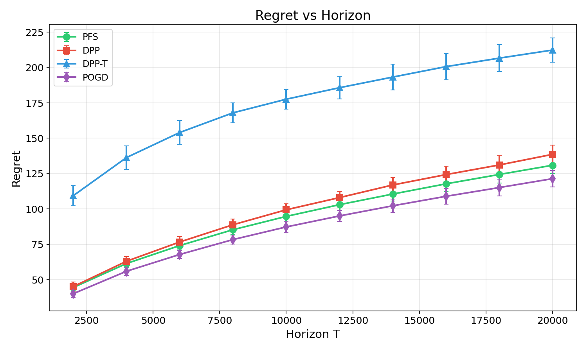
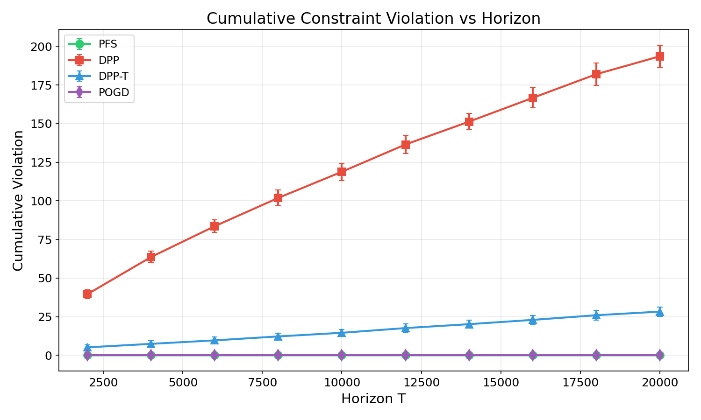
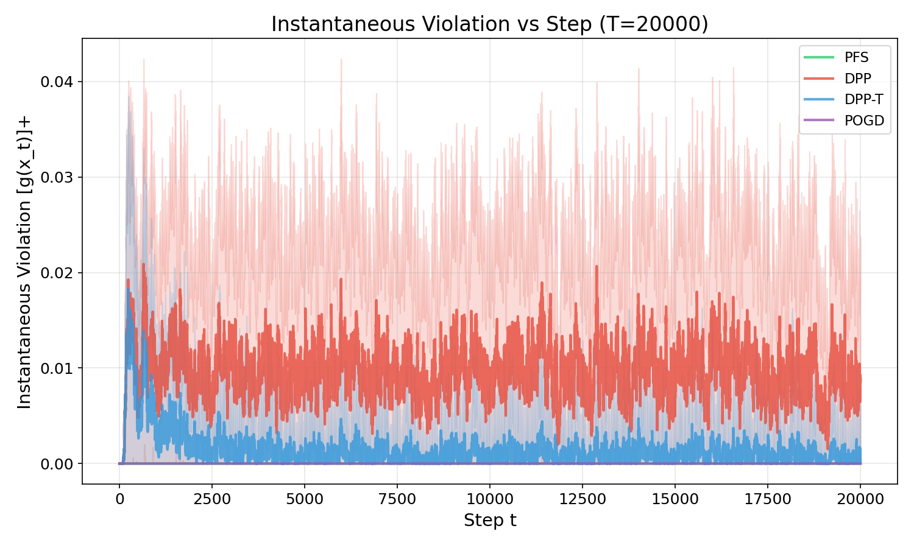
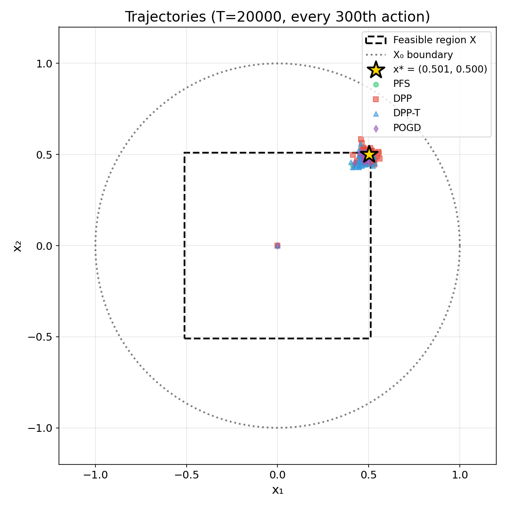
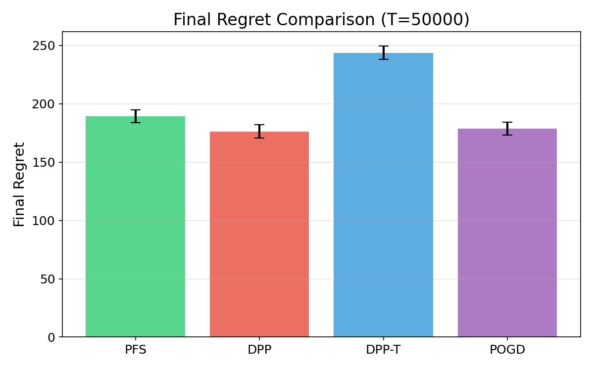
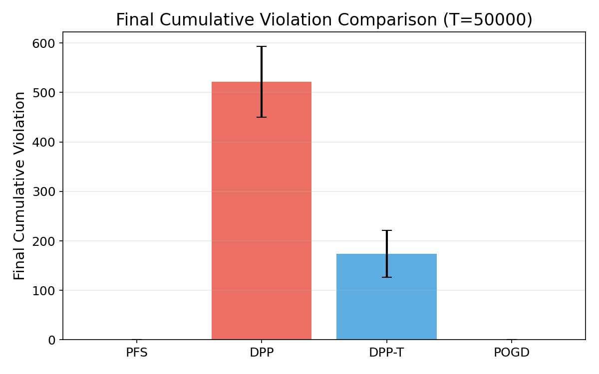
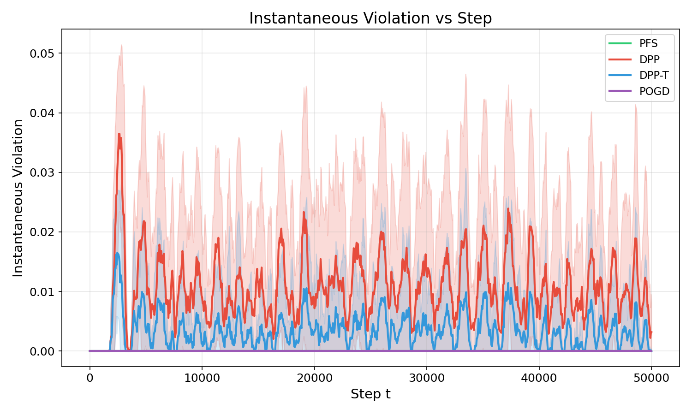
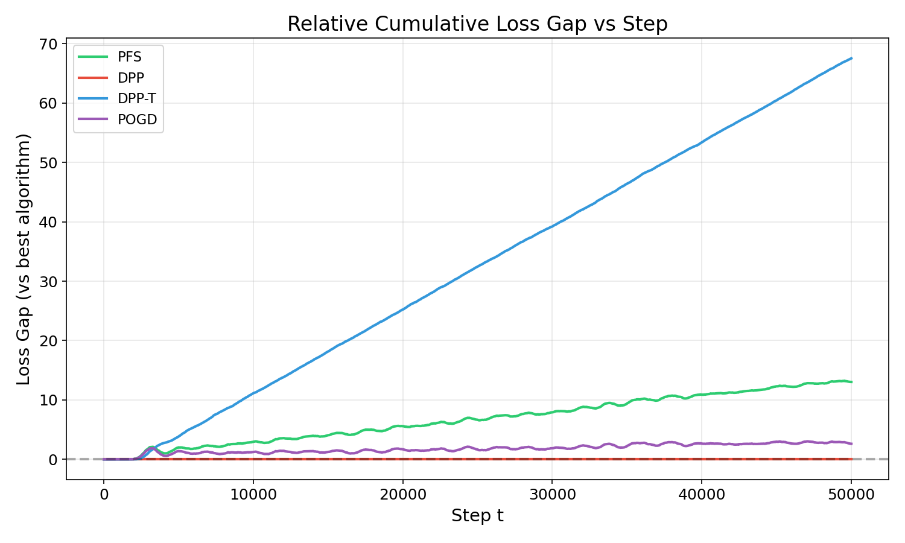

# Constrained Online Convex Optimization (OCO) с ограничениями  
## PFS (Polyak Feasibility Steps) vs базовые алгоритмы (POGD, DPP, DPP-T)

Этот репозиторий — воспроизводимый стенд для сравнения онлайн-алгоритмов выпуклой оптимизации **с ограничениями** в постановке *constrained OCO* на двух бенчмарках:
1) синтетическая квадратичная задача (Toy Quadratic),  
2) онлайн-логистическая регрессия с норм-ограничением (Online Logistic Regression).

Ключевая идея — сравнить:
- **POGD**: классический проекционный метод (с проекцией на истинно допустимое множество $X$),
- **DPP**: primal–dual подход **Drift-Plus-Penalty** с виртуальной очередью,
- **DPP-T**: DPP с **tightening** (усиленным ограничением),
- **PFS**: OGD + **Polyak Feasibility Steps** (в стиле статьи 2025), где ограничение контролируется «поляк-шагом» при одной проверке ограничения за раунд.

---

## 1. Постановка задачи (constrained OCO)

На каждом шаге $t=1,\dots,T$ алгоритм выбирает решение $x_t \in X_0$ (простое множество, на которое легко проектировать). Затем начисляется выпуклая потеря $f_t(x_t)$ и измеряется нарушение ограничения $g(x_t)$, где допустимая область задаётся как:

```math
X = \{x \in X_0 : g(x) \le 0\}
```

### Метрики качества

**Regret** относительно лучшего фиксированного решения из допустимой области:

```math
\mathrm{Regret}_T = \sum_{t=1}^T f_t(x_t) - \min_{x \in X} \sum_{t=1}^T f_t(x)
```

В коде baseline $\min_{x \in X} \sum_{t=1}^T f_t(x)$ вычисляется через **batch-оптимизацию** (отдельный солвер) для честного подсчёта regret.

### Метрики соблюдения ограничения

Мгновенное нарушение:

```math
\mathrm{viol}_t = [g(x_t)]_+ = \max(g(x_t), 0)
```

Кумулятивное нарушение:

```math
\mathrm{CumViol}_T = \sum_{t=1}^T [g(x_t)]_+
```

Максимальное нарушение:

```math
\mathrm{MaxViol}_T = \max_{t \le T} [g(x_t)]_+
```

---

## 2. Реализованные алгоритмы

Во всех алгоритмах соблюдается инженерное требование эксперимента: **одна проверка ограничения на раунд** (в коде это реализовано тем, что `algo.step()` возвращает $(x_t, g_t)$, а $g_t = g(x_t)$ запрашивается ровно один раз). Для PFS/DPP также используется субградиент ограничения $u_t \in \partial g(x_t)$; в рамках модели доступа считается, что он доступен вместе с запросом ограничения.

### 2.1 POGD — Projected Online Gradient Descent

Классическая проекция на истинное допустимое множество $X$:

```math
x_{t+1} = \Pi_X\left(x_t - \eta \nabla f_t(x_t)\right), \quad \eta = \frac{\eta_{\mathrm{const}}}{\sqrt{T}}
```

**Сильная сторона:** почти всегда лучший regret, если проекция на $X$ дешёвая.  
**Слабая сторона:** в общем случае проекция на $X$ может быть вычислительно тяжёлой/неизвестной.

---

### 2.2 DPP — Drift-Plus-Penalty (Yu et al., 2017)

Primal–dual метод с виртуальной очередью $Q_t \ge 0$ для контроля ограничения:

1) градиенты в точке $x_t$:  
   - $\nabla f_t(x_t)$  
   - $g_t = g(x_t)$  
   - $u_t \in \partial g(x_t)$

2) primal-шаг (проекция только на простое множество $X_0$):

```math
d_t = V \nabla f_t(x_t) + Q_t u_t
```

```math
x_{t+1} = \Pi_{X_0}\left(x_t - \frac{d_t}{2\alpha}\right)
```

3) обновление очереди:

```math
Q_{t+1} = \max\left(Q_t + g(x_t) + u_t^\top (x_{t+1} - x_t), 0\right)
```

В коде используются параметры по классическому масштабу:

```math
\alpha = T, \quad V = \sqrt{T}
```

---

### 2.3 DPP-T — DPP с tightened constraint

То же, что DPP, но очередь обновляется по **усиленному** ограничению:

```math
g_\rho(x) = g(x) + \rho
```

где tightening берётся как

```math
\rho(T) = \min\left(\varepsilon, \sqrt{\frac{c}{T}}\right)
```

Интуиция: tightening должен уменьшать реальное нарушение $g(x)$, но часто платой становится ухудшение regret.

---

### 2.4 PFS — OGD + Polyak Feasibility Steps (стиль статьи 2025)

Шаг состоит из двух частей:

1) **градиентный шаг по потере**:

```math
y_t = x_t - \eta \nabla f_t(x_t)
```

2) **Polyak feasibility step** по линейной аппроксимации ограничения в точке $x_t$:
   пусть $g_t = g(x_t)$ и $s_t \in \partial g(x_t)$. Рассмотрим линейную модель в точке $x_t$:

```math
\ell_t(y) = g_t + s_t^\top (y - x_t) + \rho
```

Если $\ell_t(y_t) > 0$, делаем «поляк-шаг»:

```math
y_t \leftarrow y_t - \frac{\ell_t(y_t)}{\|s_t\|^2} s_t
```

3) проекция на простое множество $X_0$:

```math
x_{t+1} = \Pi_{X_0}(y_t)
```

В коде tightening:

```math
\rho(T) = \min\left(\varepsilon, \sqrt{\frac{\alpha}{T}}\right), \quad \alpha = \varepsilon
```

а шаг:
- либо $\eta = \dfrac{\eta_{\mathrm{const}}}{\sqrt{T}}$ (если задано в конфиге),
- либо дефолтно $\eta = \dfrac{\rho}{2\sqrt{2}}$ (как удобный масштаб для toy-задачи).

---

## 3. Бенчмарки (задачи)

### 3.1 Toy Quadratic (Benchmark A)

Потери:

```math
f_t(x) = 3\|x - v_t\|_2^2, \quad v_t \sim \mathrm{Unif}([0,1]^d)
```

Простое множество:

```math
X_0 = B(R) = \{x : \|x\|_2 \le R\}
```

Ограничение и допустимое множество:

```math
g(x) = \|x\|_\infty - b, \quad X = \{x : \|x\|_\infty \le b\} = [-b, b]^d
```

---

### 3.2 Online Logistic Regression (Benchmark B)

Потери (логистическая):

```math
f_t(w) = \log\left(1 + \exp(-y_t \cdot w^\top x_t)\right), \quad y_t \in \{-1, +1\}
```

Генерация данных:
- $x_t \sim \mathcal{N}(0, I)$,
- фиксируется скрытый вектор $w^\star$ с $\|w^\star\|_2 = 1$,
- затем $y_t = +1$ с вероятностью $\sigma\left((w^\star)^\top x_t\right)$, иначе $-1$.

Простое множество:

```math
X_0 = B(R_0) = \{w : \|w\|_2 \le R_0\}
```

Ограничение и допустимое множество:

```math
g(w) = \|w\|_2 - B, \quad X = B(B) = \{w : \|w\|_2 \le B\}
```

---

## 4. Как запустить

### 4.1 Установка зависимостей

Вариант через `requirements.txt`:
```bash
python -m venv .venv
pip install -r requirements.txt
pip install -e .
```

Либо через `pyproject.toml` (если вы предпочитаете PEP-517/518 окружение):

```bash
pip install -e .
```

---

### 4.2 Запуск эксперимента

Запуск через модуль:

```bash
python -m oco.run_experiment --config configs/toy.yaml
python -m oco.run_experiment --config configs/logreg.yaml
```

Или через консольные entrypoints:

```bash
oco-run --config configs/toy.yaml
oco-run --config configs/logreg.yaml
```

**Куда сохраняются результаты:**
после запуска создаётся папка вида:

```
results/<benchmark>/<YYYYMMDD_HHMMSS>/
```

В неё сохраняется:

* `config_resolved.yaml` — зафиксированный конфиг,
* `metrics_step.csv` — метрики по шагам (с сабсэмплингом на больших T),
* `metrics_agg.csv` — агрегаты по каждому trial,
* `metrics_summary.csv` — mean/std по trial,
* `optimal_points.json` — точки batch-оптимума (для траекторий),
* набор `.png`-графиков (если запущен plotting).

---

### 4.3 Построение графиков по результатам

```bash
python -m oco.plot_results --input results/toy/<TIMESTAMP>
python -m oco.plot_results --input results/logreg/<TIMESTAMP>
```

или:

```bash
oco-plot --input results/toy/<TIMESTAMP>
oco-plot --input results/logreg/<TIMESTAMP>
```

---

## 5. Конфиги и гиперпараметры

Конфиги лежат в `configs/`.

### `configs/toy.yaml` (Toy Quadratic)

* `problem.d`, `problem.R`, `problem.b`
* `experiment.horizons` — список горизонтов $T$
* `experiment.trials` — число прогонов
* алгоритмы:

  * `PFS.epsilon`
  * `DPP` (без параметров, использует $\alpha = T$, $V = \sqrt{T}$)
  * `DPP-T.epsilon`, `DPP-T.c`
  * `POGD.eta_const`

### `configs/logreg.yaml` (Online Logistic Regression)

* `problem.d`, `problem.R0`, `problem.B`, `problem.w_star_seed`
* `experiment.horizons` (по умолчанию `[50000]`)
* `batch_solver.*` — параметры batch-солвера для regret baseline
* алгоритмы:

  * `PFS.epsilon`, `PFS.eta_const`
  * `DPP`
  * `DPP-T.epsilon`, `DPP-T.c`
  * `POGD.eta_const`

---

## 6. Структура проекта

```
configs/
  toy.yaml
  logreg.yaml

src/oco/
  run_experiment.py        # запуск экспериментов и логирование метрик
  plot_results.py          # генерация графиков из папки результатов

  algorithms/
    base.py                # общий интерфейс Algorithm
    pfs.py                 # PFS (Polyak Feasibility Steps)
    pogd.py                # POGD (проекция на X)
    dpp.py                 # DPP (Drift-Plus-Penalty)
    dppt.py                # DPP-T (tightening)

  problems/
    toy_quadratic.py       # Toy Quadratic benchmark
    online_logreg.py       # Online Logistic Regression benchmark

  utils/
    logging.py             # MetricsLogger (step/agg/summary)
    projections.py         # project_ball, project_box
    subgradients.py        # субградиенты норм
    batch_opt.py           # batch-решатели для regret baseline
    seeding.py             # сидирование/воспроизводимость

src/results/
  ...                      # пример уже сгенерированных результатов (см. ниже)
```

---

## 7. Пример результатов

Ниже — примеры графиков из папки `src/results/` (это **демо-артефакты**, чтобы README был самодостаточным).
При ваших запусках аналогичные файлы появятся в `results/...`.

---

### 7.1 Toy Quadratic (`src/results/toy/20251223_163822/`)

#### Regret vs Horizon

Из графика видно типичное поведение:

* **POGD** (проекция на $X$ дешевая — box) даёт минимальный regret,
* **PFS** идёт очень близко к POGD,
* **DPP** чуть хуже по regret,
* **DPP-T** заметно проигрывает по regret из-за tightening.



#### Кумулятивное нарушение ограничения

* **POGD** и **PFS** практически не нарушают ограничение (линия у нуля),
* **DPP** имеет существенное накопленное нарушение,
* **DPP-T** уменьшает нарушение относительно DPP, но не делает его нулевым.



#### Мгновенное нарушение (T=20000)

Хорошо видно различие в «режиме работы»:

* у **DPP** нарушение держится на ненулевом уровне почти весь горизонт,
* у **DPP-T** нарушение существенно ниже и ближе к нулю,
* у **POGD/PFS** нарушение практически нулевое.



#### Траектории (2D)

На toy-задаче удобно визуально сравнивать, как алгоритмы «подходят» к оптимуму и насколько часто выходят за допустимый box.



---

### 7.2 Online Logistic Regression (`src/results/logreg/20251223_171211/`)

#### Итоговый regret (T=50000)

По этому прогону:

* лучший regret показывает **DPP**,
* **POGD** близок к нему,
* **PFS** хуже по regret, но обеспечивает нулевое нарушение,
* **DPP-T** существенно теряет в regret.



#### Итоговое кумулятивное нарушение (T=50000)

* **POGD** — строго в $X$ (нулевое нарушение, т.к. проекция на $X = B(B)$),
* **PFS** — в этом прогоне также даёт нулевое нарушение,
* **DPP** накапливает большое нарушение,
* **DPP-T** уменьшает нарушение относительно DPP, но не устраняет.



#### Мгновенное нарушение по шагам

График подчёркивает, что у DPP/DPP-T нарушение «пульсирует» и не исчезает, тогда как POGD/PFS держатся на нуле.



#### Относительный разрыв по cumulative loss (vs лучший алгоритм)

На этом прого��е DPP является лучшим по cumulative loss (поэтому его линия — около 0), а DPP-T накапливает большой разрыв.



#### Сводная таблица (mean/std по trial, T=50000)

(Таблица ниже — точная расшифровка изображения `summary_table.png`.)

|  algo | regret_mean | regret_std | cum_viol_mean | cum_viol_std | max_viol_mean | max_viol_std |
| ----: | ----------: | ---------: | ------------: | -----------: | ------------: | -----------: |
|   PFS |      189.27 |       5.55 |          0.00 |         0.00 |          0.00 |         0.00 |
|   DPP |      176.24 |       5.78 |        521.37 |        71.85 |          0.07 |         0.01 |
| DPP-T |      243.76 |       5.79 |        174.14 |        47.47 |          0.05 |         0.01 |
|  POGD |      178.86 |       5.56 |          0.00 |         0.00 |          0.00 |         0.00 |


---

## 8. Интерпретация наблюдаемого trade-off

Практическая картина (по двум бенчмаркам) укладывается в ожидаемый **компромисс**:

* **Когда проекция на истинно допустимое $X$ дешёвая** (toy-задача, $X$ — box), **POGD** часто становится сильнейшим ориентиром по regret и при этом не нарушает ограничение.

* **PFS** стремится приблизиться к качеству POGD, оставаясь при этом в режиме «простая проекция на $X_0$ + одна проверка ограничения». На toy-задаче он действительно близок к POGD по regret и не нарушает ограничение на практике.

* **DPP** и **DPP-T** демонстрируют характерное поведение primal–dual: можно выигрывать по regret (или быть конкурентным), но цена — заметное накопленное нарушение (особенно у DPP). Tightening (DPP-T) снижает нарушение, но обычно ухудшает regret.

---